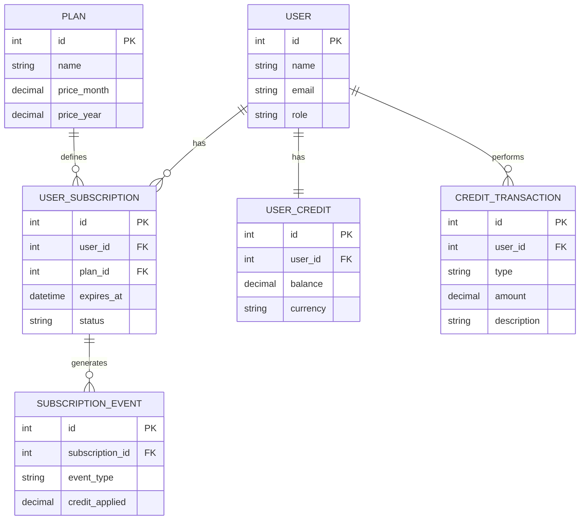

```mermaid
erDiagram
    USER ||--o{ USER_SUBSCRIPTION : has
    USER ||--|| USER_CREDIT : has
    USER ||--o{ CREDIT_TRANSACTION : performs
    PLAN ||--o{ USER_SUBSCRIPTION : defines
    USER_SUBSCRIPTION ||--o{ SUBSCRIPTION_EVENT : generates
    
    USER {
        int id PK
        string name
        string email
        string role
    }
    
    PLAN {
        int id PK
        string name
        decimal price_month
        decimal price_year
    }
    
    USER_SUBSCRIPTION {
        int id PK
        int user_id FK
        int plan_id FK
        datetime expires_at
        string status
    }
    
    USER_CREDIT {
        int id PK
        int user_id FK
        decimal balance
        string currency
    }
    
    CREDIT_TRANSACTION {
        int id PK
        int user_id FK
        string type
        decimal amount
        string description
    }
    
    SUBSCRIPTION_EVENT {
        int id PK
        int subscription_id FK
        string event_type
        decimal credit_applied
    }
```