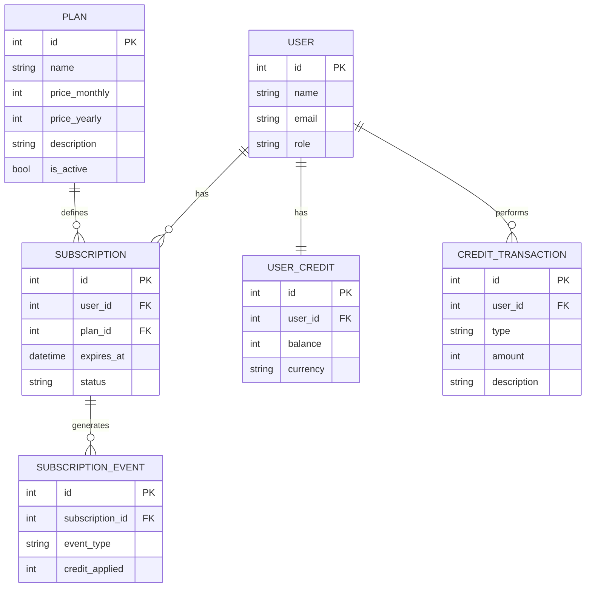

```mermaid
erDiagram
    USER ||--o{ SUBSCRIPTION : has
    USER ||--|| USER_CREDIT : has
    USER ||--o{ CREDIT_TRANSACTION : performs
    PLAN ||--o{ SUBSCRIPTION : defines
    SUBSCRIPTION ||--o{ SUBSCRIPTION_EVENT : generates
    
    USER {
        int id PK
        string name
        string email
        string role
    }
    
    PLAN {
        int id PK
        string name
        int price_monthly
        int price_yearly
        string description
        bool is_active
    }
    
    SUBSCRIPTION {
        int id PK
        int user_id FK
        int plan_id FK
        datetime expires_at
        string status
    }
    
    USER_CREDIT {
        int id PK
        int user_id FK
        int balance
        string currency
    }
    
    CREDIT_TRANSACTION {
        int id PK
        int user_id FK
        string type
        int amount
        string description
    }
    
    SUBSCRIPTION_EVENT {
        int id PK
        int subscription_id FK
        string event_type
        int credit_applied
    }
```